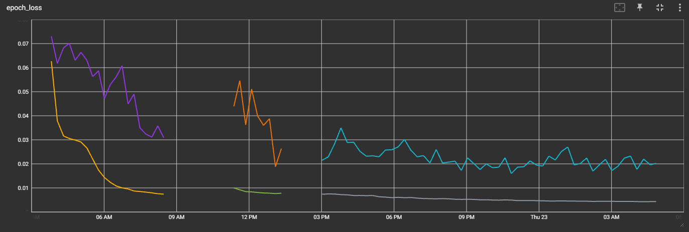
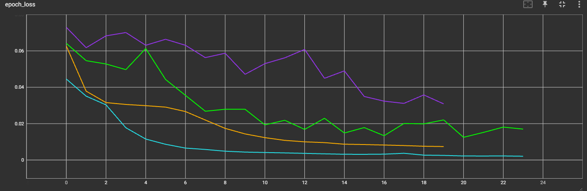
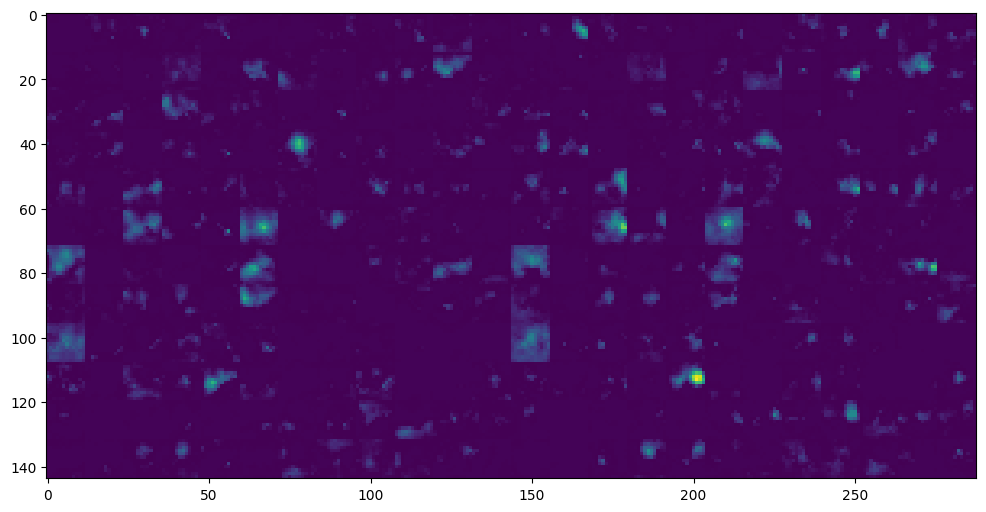

about the model(s)

required:
* models must normalize images themselves from 0-255 to whatever they need
* models must take input of frame count, x, y, channels. At the moment frame count is fixed per model (60)
* don't shrink a post LSTM layer to less than the frame count

desirable:
* models should resize images themselves on the GPU
    * probably, I don't know what is more of a bottleneck, moving more, bigger tensors to GPU and potentially consuming VRAM. or CPU capacity.

concept:

Just like any "fine tune this pretrained model guide":
1. We get a pretrained model.
2. We slap a dense layer on it

but then

3. We wrap it in a time distributed
4. We use bidirectional LSTM
5. We arbitrarily chain some dense layers and dropouts, down to a final dense layer of the frame count side

the results:

A brute force approach to linear movement estimation in sequential images.

'

'

'

### model stuff

effv2s_60in_60out models training loss curve. After about 24 hours of training, ending mse 0.0043 for training, 0.02 for validation. learning rates...probably 1e-3 to start and then LR Reduction on Plateau.

Running testing for hyperparameter tuning effv2s_60in_60out_variants in progress. Current loss curve compared to previous below. 0.00204 mse for training, 0.01699 for validation after 6 hours.

i.e. it's learning better and has a better validation score. Partly because I've used significantly lower dropout rates which contribute to learning speed. This variant has 183mb trainable parameters, plus the 80mb of frozen parameters in the efficientnetv2S model.

It's structured as:

    input_shape = (60, 384, 384, 3)
    inputs = keras.Input(shape=input_shape)
    backbone = efficientnet.EfficientNetV2S(pretrained=backbone_path,dropout=1e-6, num_classes=0, include_preprocessing = True)
    backbone.trainable = False
    backbone_inputs = keras.Input(shape=(384, 384, 3))
    y = backbone(backbone_inputs)
    y = layers.Flatten()(y)
    y = layers.Dense(256, activation="relu")(y)
    y = layers.Dropout(1e-6)(y)
    x = layers.TimeDistributed(keras.Model(backbone_inputs, y))(inputs)
    x = layers.Dropout(1e-6)(x)
    x = layers.Bidirectional(layers.LSTM(128, return_sequences=True))(x)
    x = layers.Dropout(1e-6)(x)
    x = layers.Bidirectional(layers.LSTM(128, return_sequences=False))(x)
    x = layers.Dropout(1e-6)(x)
    outputs = layers.Dense(60, activation="relu")(x)

The large 256 dense layer connected to the 184320 parameter output of the efficientnetv2S allows it to learn more about the features and use that information. In the sixty_small_body_ryhthm_time_bidirectional model there's only 64 neurons in that layer and more subsequent LSTM and Dense layers, resulting in only ~20mb of trainable parameters (or less?) which was only just enough for it to derive information from the features layer to make valid predictions and the model was functionally underfitting. The new model will likely be named sixty_small_body_ryhthm_time_bidirectional_thicc or something to indicate the larger middle if it makes it to huggingface.

I've kept away from using global pooling after the feature extractor for fear of losing relevant information. This is all amateur knowledge and haven't spared the time to try it out. I know classification uses it, but in this use case I have the suspicion that it would strip away relevant positional information.

'

'

### scratchpad

I need to label more data. I need to write a new labeller workflow.

I've previously trained using frame skipping (simulate 30fps data vs 60fps) and faster movements but haven't updated it for the current dataset. I need to revisit.

I've observed sixty_small_body_ryhthm_time_bidirectional 

Q: Why 60 frames of prediction? 

A: 9 frames was too jittery. Overlapping predictions don't smooth nice enough.

It might be worth training on non linear frames to make the model less linear or more adaptable. May even mix up videos in a sequence or find matching trajectories across videos and mash together

The training data is all created by hand and does not use peak to peak linear values (sawtooth). It is not using community or commercially generated funscripts. The goal is to generate base funscripts to enhance throughput of funscript creators, to help them compete with AI, not to replace them with AI.

Currently I've only trained my extra layers on the efficientnetv2 S model. The XL model should score higher. Also finetuning the base model may yield positive results.

Larger models have been more difficult to use as a backbone. e.g. This is efficientnetv2S features with the left half being on a tight crop of a point of interest, and the right half being 10 frames after. In a funscript, the first would be a pos of ~60, the second being a pos of ~80.

This is the efficientnetv2m

This is the efficientnetv2l

At a glance, the v2S features are much more obvious. The model sixty_small_body_ryhthm_time_bidirectional that is the current default and only has a 64 Dense layer. This doesn't seem to be enough to get neccessary detail from the larger models, even though their feature outputs aren't vastly different, e.g. 

    efficientnetv2S: (1, 12, 12, 1280) = 184,320
    efficientnetv2M: (1, 15, 15, 1280) = 288,000
    efficientnetv2L: (1, 16, 16, 1280) = 327,680

The images above are those arrays visualized with:

    def plot_features(features, x, y):
        features_image = np.zeros((0, 0))
        for j in range(0, y):
            row = np.zeros((0, 0))
            for i in range(0, x):
                if i == 0:
                    row = features[0, :, :, j * x + i]
                else:
                    row = np.hstack((row, features[0, :, :, j * x + i]))
            if j == 0:
                features_image = row
            else:
                features_image = np.vstack((features_image, row))
        return features_image

A global pooling layer can reduce the dimensions to (1, 1280), which might eliminate the need for a dense layer, or enable it to be smaller and still get the detail needed. Or even testing with the small model more and a larger Dense layer to find the point of diminishing returns with it. Also known as hyperparameter tuning.

